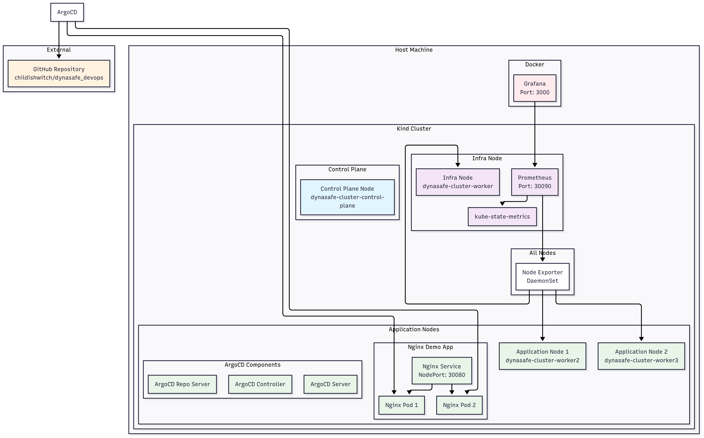
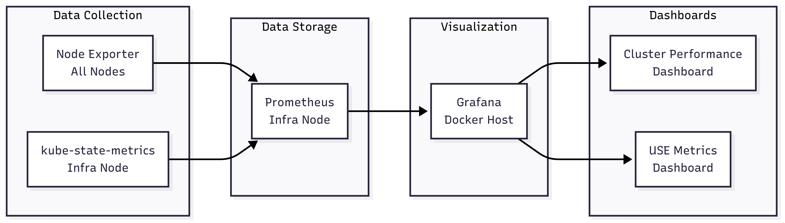
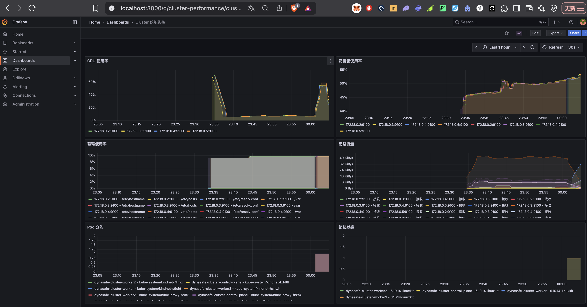
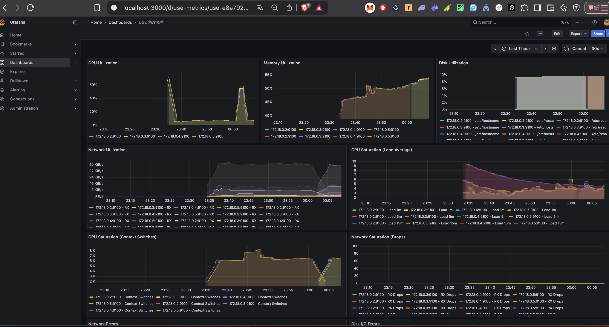
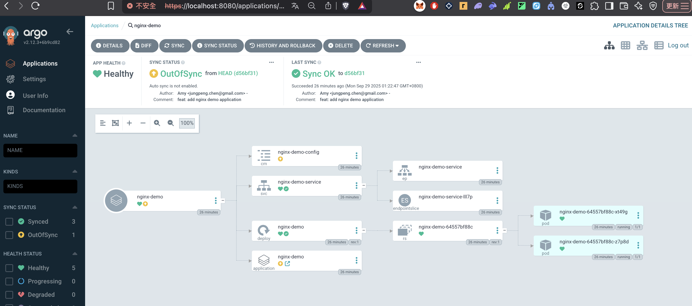
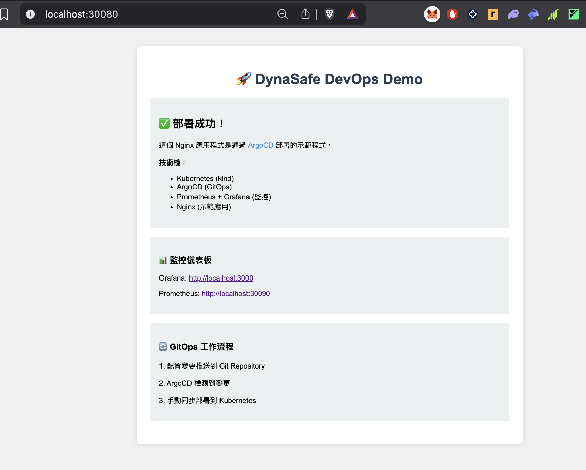

# DevOps 面試作業 - Kubernetes 監控與部署平台

## 作業概述

本專案使用 kind 架設 Kubernetes 叢集，並整合 Prometheus、Grafana 監控系統以及 ArgoCD 進行 GitOps 部署。

## 架構設計

### 叢集配置
- **Control Plane**: 1個節點
- **Worker Nodes**: 3個節點
  - **Infra Node**: 1個節點（運行 Prometheus、kube-state-metrics）
  - **Application Nodes**: 2個節點（運行 ArgoCD、應用程式）

### 監控架構
- **Prometheus**: 部署在 infra node，收集所有節點的監控數據
- **Node Exporter**: 部署在所有節點
- **kube-state-metrics**: 部署在 infra node
- **Grafana**: 部署在叢集外（Docker），連接 Prometheus 作為數據源

### GitOps 架構
- **ArgoCD**: 部署在 application node
- **Nginx**: 作為示範應用程式，通過 ArgoCD 進行部署

## 專案結構

```
dynasafe_devops/
├── README.md                 # 專案說明文件
├── kind-config.yaml          # kind 叢集配置
├── docker-compose.yml        # Grafana Docker Compose 配置
├── scripts/                  # 部署腳本
│   └── configure-nodes.sh    # 節點配置腳本
├── grafana/                  # Grafana 配置
│   └── provisioning/         # 數據源和儀表板配置
├── docs/                     # 文檔和截圖
│   └── screenshots/          # 監控儀表板和部署截圖
├── infrastructure/           # 基礎設施配置
│   ├── README.md             # 架構說明和部署指南
│   └── helm/                # Helm Charts
│       ├── monitoring/       # 監控系統
│       └── argocd/          # ArgoCD
└── applications/             # 應用程式配置
    └── nginx/                # Nginx 示範應用
```

## 環境需求

### 軟體版本
- **Docker Desktop**: 4.47.0+ (用於運行 kind 和 Grafana)
- **kind**: v0.30.0+ (Kubernetes 叢集管理)
- **kubectl**: v1.34.1+ (Kubernetes 命令行工具)
- **Helm**: v3.19.0+ (Kubernetes 套件管理)
- **Kubernetes**: v1.34.0 (透過 kind 部署)
- **Prometheus**: v2.48.0 (監控數據收集)
- **Grafana**: v12.2.0 (監控儀表板)
- **ArgoCD**: v2.10+ (GitOps 部署)

### 系統架構

本專案實現了完整的 Kubernetes 監控與 GitOps 部署平台：

- **Kubernetes 叢集**: 使用 kind 創建 1 個 control-plane + 3 個 worker 節點
- **監控系統**: Prometheus + Grafana + Node Exporter + kube-state-metrics
- **GitOps 部署**: ArgoCD 管理應用程式部署
- **節點配置**: 1 個 infra node + 2 個 application node

### 快速開始

1. **安裝必要工具**
   ```bash
   brew install kind kubectl helm
   # 安裝 Docker Desktop
   ```

2. **部署系統**
   ```bash
   # 創建叢集
   kind create cluster --config kind-config.yaml --name dynasafe-cluster
   
   # 配置節點污點
   ./scripts/configure-nodes.sh
   
   # 部署監控系統
   kubectl create namespace monitoring
   helm install monitoring ./infrastructure/helm/monitoring -n monitoring
   
   # 部署 ArgoCD
   kubectl create namespace argocd
   helm install argocd ./infrastructure/helm/argocd -n argocd
   
   # 啟動 Prometheus port-forward
   kubectl port-forward -n monitoring svc/monitoring-prometheus-server 30090:80 &
   
   # 啟動 ArgoCD port-forward
   kubectl port-forward -n argocd svc/argocd-server 8080:80 &
   
   # 部署 nginx 示範應用
   kubectl apply -f applications/nginx/argocd-application.yaml
   
   # 設置 nginx port-forward (Kind 環境需要，一般 K8s 環境可直接訪問 NodePort)
   kubectl port-forward svc/nginx-demo-service 30080:80 &
   
   # 啟動 Grafana
   docker-compose up -d
   
   # 獲取 ArgoCD admin 密碼
   kubectl -n argocd get secret argocd-initial-admin-secret -o jsonpath="{.data.password}" | base64 -d
   ```

3. **訪問服務**
   - **Grafana**: http://localhost:3000 (admin/admin123)
   - **Prometheus**: http://localhost:30090
   - **ArgoCD**: https://localhost:8080 (admin/上一步獲取的密碼)
   - **Nginx Demo**: http://localhost:30080 (ArgoCD 部署的示範應用)

## 系統架構

### 整體架構圖


### 監控架構圖


## 監控儀表板

### 1. Cluster 效能監控儀表板
呈現叢集整體效能監控數據，包含以下 6 個監控面板：



**面板內容說明：**
- **CPU 使用率** - 顯示各節點的 CPU 使用百分比，包含 1m、5m、15m 負載平均值
- **記憶體使用率** - 顯示各節點的記憶體使用百分比和可用記憶體
- **磁碟使用率** - 顯示各節點不同掛載點的磁碟使用情況
- **網路流量** - 顯示各節點的網路接收/傳送流量（KiB/s）
- **Pod 分佈** - 顯示各節點上運行的 Pod 數量分佈
- **節點狀態** - 顯示節點基本信息和內核版本

### 2. USE 角度監控儀表板
呈現 USE（Utilization、Saturation、Errors）角度的效能監控數據：



**面板內容說明：**

#### Utilization (使用率)
- **CPU Utilization** - CPU 使用率，顯示各節點 CPU 資源使用情況
- **Memory Utilization** - 記憶體使用率，顯示各節點記憶體資源使用情況
- **Disk Utilization** - 磁碟使用率，顯示各節點磁碟空間使用情況
- **Network Utilization** - 網路使用率，顯示各節點網路接收/傳送流量

#### Saturation (飽和度)
- **CPU Saturation (Load Average)** - CPU 負載平均值，包含 1m、5m、15m 負載
- **CPU Saturation (Context Switches)** - CPU 上下文切換次數，反映 CPU 飽和度
- **Network Saturation (Drops)** - 網路丟包情況，反映網路介面飽和度

#### Errors (錯誤)
- **Network Errors** - 網路介面錯誤率，包含接收和傳送錯誤
- **Disk I/O Errors** - 磁碟 I/O 錯誤率，反映磁碟健康狀態

## GitOps 部署

### ArgoCD 部署管理
使用 ArgoCD 實現 GitOps 工作流程，管理應用程式部署：



### Nginx 示範應用程式
通過 ArgoCD 部署的 Nginx 示範應用程式：



**功能特點：**
- **GitOps 工作流程** - 配置變更推送到 Git，ArgoCD 自動檢測
- **手動同步** - 展示 ArgoCD 的手動同步功能
- **自定義首頁** - 展示 DynaSafe DevOps Demo 資訊
- **健康檢查** - 包含 liveness 和 readiness probe
- **資源限制** - CPU 100m, Memory 128Mi

## 文檔

- [完整說明文件](docs/README.md) - 包含架構圖、配置說明、監控儀表板說明
- [架構圖](docs/architecture-diagram.md) - 系統架構 Mermaid 圖表
- [架構說明](infrastructure/README.md) - 基礎設施配置說明
