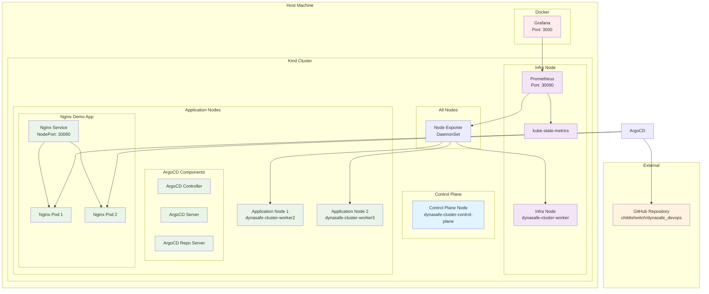
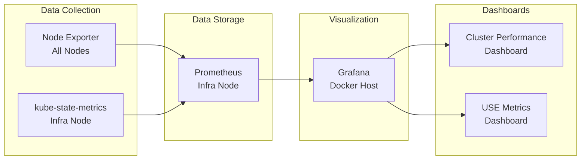
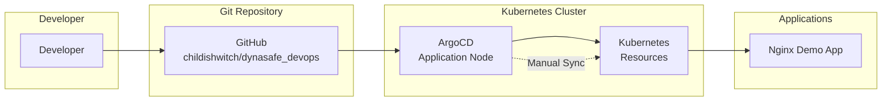
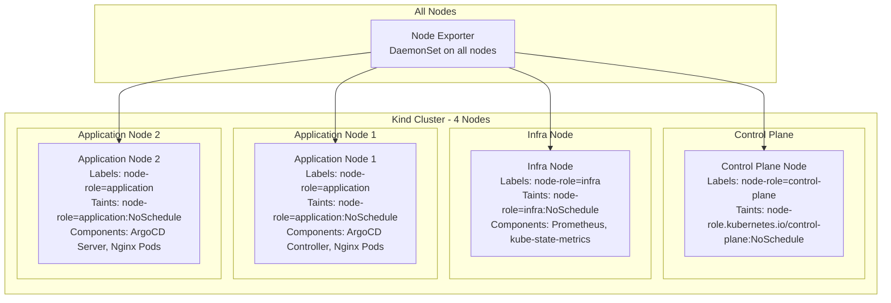

# 系統架構圖

## 整體架構

## 監控架構

## GitOps 架構

## 節點配置

## 配置檔案清單

### Kubernetes 配置檔
- `kind-config.yaml` - Kind 叢集配置
- `scripts/configure-nodes.sh` - 節點標籤和污點配置腳本

### Helm Charts
- `infrastructure/helm/monitoring/` - 監控系統 Helm Chart
  - `Chart.yaml` - Chart 定義
  - `values.yaml` - 監控系統配置值
- `infrastructure/helm/argocd/` - ArgoCD Helm Chart
  - `Chart.yaml` - Chart 定義
  - `values.yaml` - ArgoCD 配置值

### 應用程式配置
- `applications/nginx/deployment.yaml` - Nginx Deployment
- `applications/nginx/service.yaml` - Nginx Service
- `applications/nginx/configmap.yaml` - Nginx 配置
- `applications/nginx/argocd-application.yaml` - ArgoCD Application

### 監控配置
- `docker-compose.yml` - Grafana Docker 配置
- `grafana/provisioning/` - Grafana 自動配置
  - `datasources/prometheus.yml` - Prometheus 數據源
  - `dashboards/` - 監控儀表板配置

## 監控儀表板截圖

### Grafana 儀表板
- `docs/screenshots/grafana_dashboards_cluster.png` - Cluster 效能監控
- `docs/screenshots/grafana_dashboards_use.png` - USE 角度監控

### 系統截圖
- `docs/screenshots/argocd.png` - ArgoCD 管理介面
- `docs/screenshots/nginx.png` - Nginx 示範應用程式
